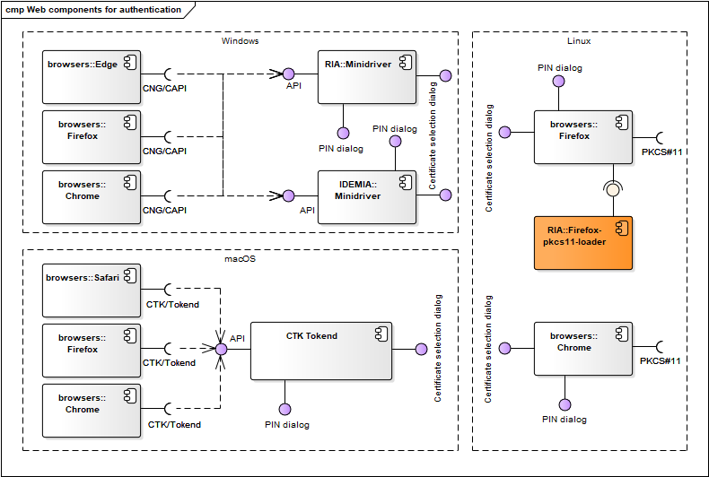
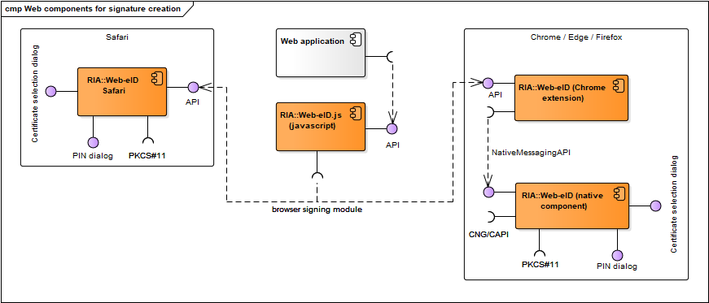
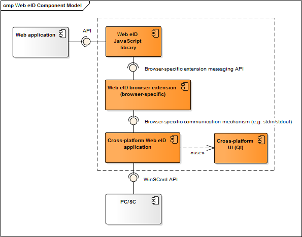
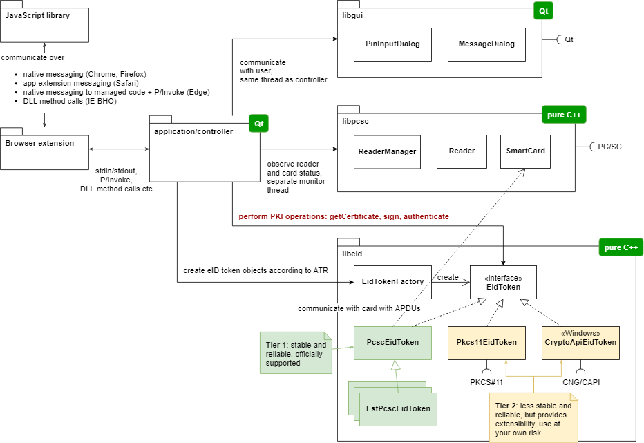
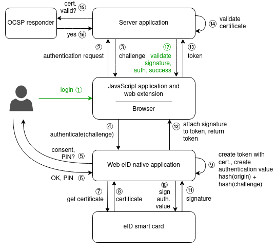
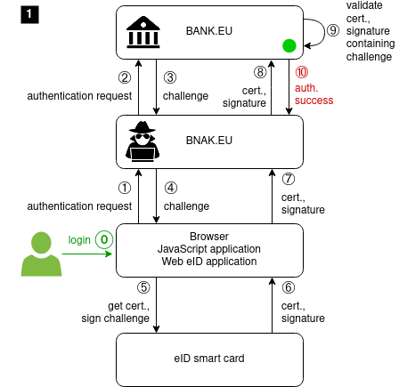
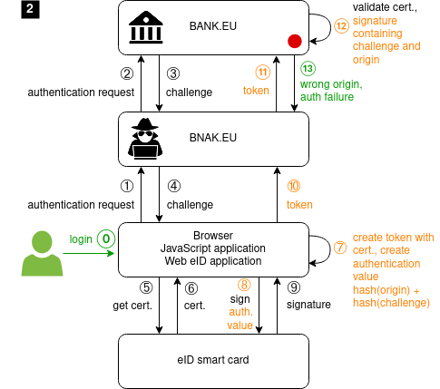
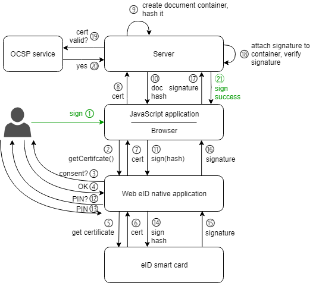
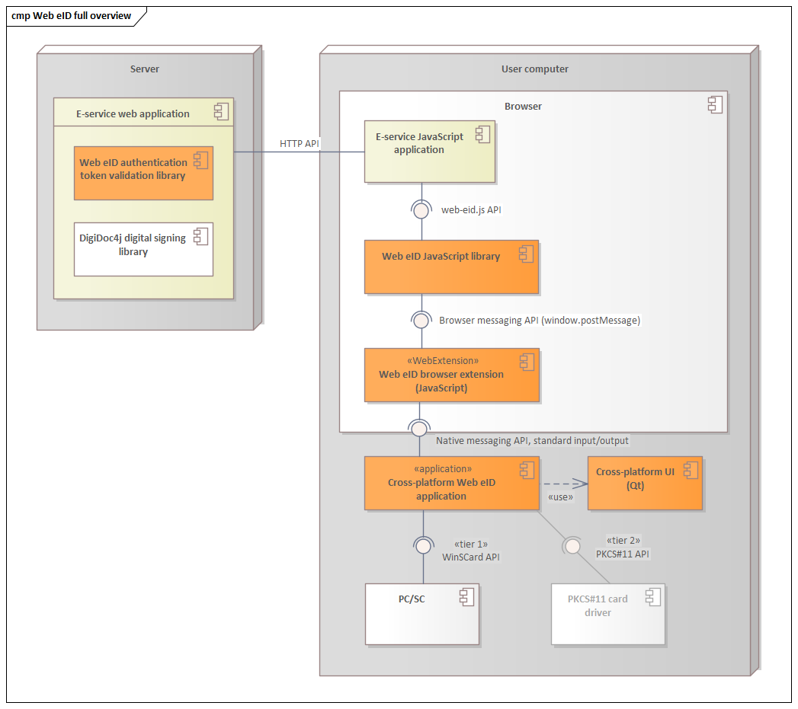

# Web eID: electronic identity cards on the Web

## Table of Contents

* [Introduction](#introduction)
  * [Use cases](#use-cases)
    * [Authentication](#authentication)
    * [Signing documents](#signing-documents)
  * [Web eID project websites](#web-eid-project-websites)
  * [Requirements notation and conventions](#requirements-notation-and-conventions)
  * [Glossary](#glossary)
* [Design choices](#design-choices)
  * [Overview of the current Open eID implementation](#overview-of-the-current-open-eid-implementation)
  * [Problems of the current implementation](#problems-of-the-current-implementation)
  * [Principles of the new technical design](#principles-of-the-new-technical-design)
* [Requirements for the new solution](#requirements-for-the-new-solution)
  * [Support for other security tokens besides smart cards](#support-for-other-security-tokens-besides-smart-cards)
* [New solution architecture](#new-solution-architecture)
  * [Technical overview of authentication and digital signing](#technical-overview-of-authentication-and-digital-signing)
    * [Authentication](#authentication-1)
      * [Authentication and WebAuthn](#authentication-and-webauthn)
      * [Authenticated identity](#authenticated-identity)
      * [Authentication and TLS Token Binding](#authentication-and-tls-token-binding)
      * [Protection against man\-in\-the\-middle attacks during authentication with origin validation](#protection-against-man-in-the-middle-attacks-during-authentication-with-origin-validation)
    * [Digital signing](#digital-signing)
  * [The full overview](#the-full-overview)
  * [Security analysis](#security-analysis)
  * [JavaScript library](#javascript-library)
  * [Web eID authentication token specification](#web-eid-authentication-token-specification)
    * [Token format](#token-format)
    * [Requesting a Web eID authentication token](#requesting-a-web-eid-authentication-token)
  * [Browser extensions](#browser-extensions)
    * [Chrome, Edge and Firefox](#chrome-edge-and-firefox)
    * [Safari](#safari)
    * [Internet Explorer](#internet-explorer)
  * [Native application](#native-application)
    * [Native application messaging API](#native-application-messaging-api)
      * [General](#general)
      * [PKI operations](#pki-operations)
  * [libpcsc\-cpp: PC/SC library](#libpcsc-cpp-pcsc-library)
  * [libelectronic\-id: eID token library](#libelectronic-id-eid-token-library)
  * [Web eID authentication token validation libraries](#web-eid-authentication-token-validation-libraries)
  * [Implementation guide and example applications](#implementation-guide-and-example-applications)
* [References](#references)

## Introduction

The **Web eID** project enables usage of European Union electronic identity (eID) smart cards for secure authentication and digital signing of documents on the web using public-key cryptography.

The project builds on the success of the [Estonian ID card](https://e-estonia.com/solutions/e-identity/) (EstEID) and the [Open Electronic Identity](https://github.com/open-eid) (Open eID) project that has been in operation since 2002. Most of Estonia's 1.3 million citizens have an ID card which provides digital access to all of Estonia’s secure e-services, releasing them from tedious red tape and making daily tasks faster and more comfortable while banking, signing documents, doing business or obtaining a digital medical prescription online. However, the Open eID implementation is facing certain technical challenges on the web browser platform due to its technical design that the Web eID project aims to overcome.

The Web eID solution consists of a JavaScript library, browser extension and a native application that together coordinate communication between the browser, website and the smart card to perform cryptographic operations.

The solution is cross-platform and works in all modern browsers in Windows, macOS and Linux.

This document defines the functionality and technical design of the Web eID solution.

### Use cases

The solution supports two main use cases – authentication and digital signing of documents.

#### Authentication

The user opens a website that requires authentication with an eID card, connects a card reader, inserts his/her smart card to the card reader and initiates signing in. The application asks the user for permission to send authentication certificate to the website and prompts to enter his/her authentication PIN. The user enters the authentication PIN and confirms. The website verifies the authentication data, notifies the user of successful login and displays the signed-in page.

#### Signing documents

The user opens a website that supports digital signing of documents, connects a card reader, inserts his/her smart card to the card reader and initiates digital signing. The application asks the user for permission to send digital signature certificate to the website and prompts to enter his/her digital signature PIN. The user enters the digital signature PIN and confirms. The website verifies the signature data, notifies the user of successful signing and displays the signed document.

### Web eID project websites

The Web eID project website and authentication and digital signing test web application is available at https://web-eid.eu/. Links to Git repositories with the implementation of the Web eID components are available from the Web eID GitHub organization page https://github.com/web-eid and referenced below under corresponding components' sections.

### Requirements notation and conventions

The key words "MUST", "MUST NOT", "REQUIRED", "SHALL", "SHALL NOT", "SHOULD", "SHOULD NOT", "RECOMMENDED", "NOT RECOMMENDED", "MAY", and "OPTIONAL" in this document are to be interpreted as described in [RFC 2119](https://www.rfc-editor.org/rfc/rfc2119.txt).

### Glossary

The following terms and abbreviations are used in this document:

- **APDU**, *application protocol data unit*, the communication unit between a smart card reader and a smart card
- **challenge nonce** (or challenge, or nonce), a cryptographic nonce, a large random number that can be used only once, with at least 256 bits of entropy
- **CNG**, *Cryptography API: Next Generation*, the pluggable Windows Cryptography API introduced in Windows Vista
- **CSRF**, *Cross-site request forgery*, a type of malicious exploit of a website where unauthorized commands are submitted from a user that the web application trusts
- **CTK**, *CryptoTokenKit*, a framework for accessing security tokens and the cryptographic assets they store in macOS
- **eID**, *electronic identification*, a digital solution for proof of identity of citizens or organizations
- **OCSP**, *Online Certificate Status Protocol*, an internet protocol for obtaining the revocation status of a X.509 digital certificate
- **OpenID Connect**, a simple identity layer on top of the OAuth 2.0 protocol
- **origin**, the website origin, the URL serving the web application
- **PC/SC**, *Personal Computer/Smart Card*, a specification for smart card integration into computing environments
- **PKCS#11**, one of the *Public-Key Cryptography Standards*, defines a platform-independent API to cryptographic tokens, such as hardware security modules and smart cards
- **TLS**, *Transport Layer Security*, a cryptographic protocol for secure Internet communication
- **TLS CCA**, *TLS Client Certificate Authentication*, a TLS protocol variant where the client (browser) uses a certificate to authenticate itself during the TLS handshake
- **TLS Token Binding**, a set of draft IETF RFC proposals for a TLS extension that aims to increase TLS security by using cryptographic certificates on both ends of the TLS connection
- **TokenD**, a software module for bridging a cryptographic device (like a smart card) and the CryptoTokenKit (CTK) framework in macOS
- **WebAuthn**, *Web Authentication*, an API enabling the creation and use of public key-based credentials by web applications, for the purpose of strongly authenticating users
- **WebExtensions**, a new cross-browser system for developing browser extensions

## Design choices

### Overview of the current Open eID implementation

The current Open eID implementation for using eID smart cards on the web is deeply integrated with the operating system cryptographic APIs and native browser APIs. It provides a driver for the Cryptography API: Next Generation (CNG) in Windows, CTK/TokenD plug-in in macOS and PKCS#11 driver in Linux for cryptographic operations with EstEID cards. Firefox uses PKCS#11 on all platforms. Authentication is implemented in the browser TLS session establishment layer with browser and operating system native components, using [TLS Client Certificate Authentication (CCA)](https://en.wikipedia.org/wiki/Transport_Layer_Security#Client-authenticated_TLS_handshake).

The following diagrams provide an overview of Open eID web components.

  
Figure 1: Open eID authentication components

  
Figure 2: Open eID digital signing components

The benefit of the deep integration is support for a wide range of use cases outside the web browser, e.g. secure login to the operating system with eID cards. However, there are significant downsides for the web browser platform due to that.

### Problems of the current implementation

Due to the complexity of the solution, there have been numerous browser and operating system API stability issues throughout the years where users either cannot use their eID card with the web browser or have to restart the browser or the operating system to restore function.

Here is the listing of the most prominent problems of the current implementation:

- Dependence on complex, changing operating system and browser APIs creates fragility and high maintenance cost when the APIs change.
- Different browsers use different cryptographic APIs in different operating systems (CNG, CTK/TokenD, PKCS#11).
- Authentication and signing use different mechanisms that creates additional fragility – authentication may work but signing not, which is especially confusing and frustrating for users.
- No authentication PIN prompts after first authentication until browser restart. Not asking for PIN is possible as the authentication security environment remains active on the eID smart card after first use. Without this authentication in TLS session establishment layer using TLS CCA would be infeasible as one would need to re-type the PIN for every browser request (including for media) – but not asking for authentication PIN creates security and usability problems.
- Due to the previous issue, need to restart the browser after logout from sites with high security requirements. As the authentication security environment remains active on the card, logout in the browser has no effect (it is possible to login again without a PIN prompt).
- Certificates are cached during login. When several people use the computer with their personal eID cards, their certificates [are cached](https://www.id.ee/en/article/removal-of-old-or-expired-certificates/) and later presented in the certificate selection dialog even if the card is not present. This is confusing and tedious for users as they either have to find their certificate from the list each time or manually remove unused certificates.
- Inconsistent visuals. As web browsers use different cryptographic APIs, the eID middleware user interface visuals differ in web browsers. The visuals may also differ in the same browser during authentication and signing. 

### Principles of the new technical design

The new technical design aims to overcome the problems listed above.

The principles of the new design are:

- Focus on web use cases and the web browser platform.
- Decoupling from the browser internals. Use [WebExtensions](https://wiki.mozilla.org/WebExtensions), a new cross-browser system for developing browser extensions, both for authentication and signing.
- Decoupling from the operating system internals. Use the PC/SC API to communicate with eID cards directly. PC/SC API is user space, lower-level than the operating system cryptographic APIs, stable and cross-platform. Fall back to PKCS#11 only in case the specification of the PC/SC APDU protocol is not available for the given eID card.
- Implement authentication according to the principles of the [Web Authentication API](https://www.w3.org/TR/webauthn/). Don't implement authentication in the browser TLS session establishment layer using TLS CCA. Special TLS CCA configuration is no longer required in the web servers which simplifies using eID cards in cloud services and clustered systems.
- Require HTTPS and reject requests from non-secure contexts.
- No need to restart the browser after logout as the PIN is prompted during each authentication.
- Use the same mechanism for authentication and signing.
- Use the same, consistent visuals for authentication and signing across browsers and operating systems.
- Support most common European eID smart cards.

The following diagram provides an overview of the Web eID solution components (in orange). The Safari Web Extension component model differs slightly, though not in principle, see the corresponding diagram in section *[Safari](#safari)* below.

  
Figure 3: Web eID components

## Requirements for the new solution

Besides the principles listed above, the new solution satisfies the following requirements:

1. Support authentication and digital signing with Estonian, Latvian, Finnish (tier 1) and Croatian, Lithuanian (tier 2) eID smart cards in phase 1 and other EU eID cards in next phases.
1. Support recent versions of common operating systems, Windows, macOS, Linux, and evergreen browsers Chrome, Edge, Firefox, and Safari.
1. Support easy installation and immediate launch through the browser without requiring restart of the operating system and, if possible, browser after installation. Note that the Web eID native application needs to be installed separately from the browser extension.
1. For tier 1 supported eID cards, does not require any other third party software besides the operating system standard PC/SC stack and standard card reader driver. Tier 2 cards require the availability of a third-party PKCS#11 module and installation of the corresponding eID middleware.
1. Resilient, responsive, non-blocking, message driven internal design that supports unexpected events like card or reader removal or insertion during all operations.
1. Does not interfere with other eID software components in the browser or operating system.
1. Authentication success implies signing success unless the signing PIN is blocked.

### Support for other security tokens besides smart cards

The solution is designed to be extensible so that it can support other security tokens that support public-key encryption besides smart cards, for example Yubikey. Thus in the following, the term "smart card" or "eID card" also refers to other security tokens that support public-key encryption.

## New solution architecture

The following diagram provides an overview of the internal design of the new solution:

  
Figure 4: Web eID internal design

- JavaScript library `web-eid.js` is a thin wrapper on top of the messaging interface provided by the Web eID native application via the Web eID browser extension.
- The Web eID browser extension is either a [WebExtensions](https://wiki.mozilla.org/WebExtensions) extension in browsers that support it (Chrome, Edge and Firefox) or a [Web Extension](https://developer.apple.com/documentation/safariservices/safari_web_extensions) in Safari for macOS. The Safari extension architecture is slightly different. See section *[Safari](#safari)* below for details.
- The browser extension communicates with the Web eID native application installed on the host using native messaging.
- The native application is built with Qt and consists of the application, controller and UI modules and uses the `libpcsc-cpp` and `libelectronic-id` libraries.
- The controller module is a Qt library responsible for coordinating interaction between other components and the browser extension. Controller is event-based. Card event monitoring and communication with the eID card runs in separate threads from the main application thread. The controller module contains thread management classes and command handlers that perform PKI operations like signing and retrieving the certificate.
- The UI module contains cross-platform Qt dialogs that the application uses to communicate with the user.
- `libpcsc-cpp` is a pure C++ library for accessing smart cards using the PC/SC API.
- `libelectronic-id` is a pure C++ library for performing cryptographic operations with eID smart cards that encapsulates the cards' APDU commands and manages communication with the smart card by using `libpcsc-cpp` services. It also supports using the PKCS#11 API in case the APDU commands are not available.
- Electronic ID cards are divided into two tiers:
  - for tier 1 cards, the specification of the PC/SC APDU protocol is available and the PC/SC API is used to communicate with the cards directly;
  - for tier 2 cards, the specification of the PC/SC APDU protocol is *not* available and the PKCS#11 API is used to communicate with the card instead, which requires the availability of a third-party PKCS#11 module.

### Technical overview of authentication and digital signing

The authentication and digital signing processes share a common scheme – the Web eID application signs a server-sent datagram with the private key on the smart card and sends the certificate and signature cryptogram back to the server. Server verifies if the certificate is valid and verifies the signature with the public key from the certificate.

In the following sections, _JavaScript application_ is the website's client-side front end application in the browser that uses the `web-eid.js` library APIs to perform authentication and signing.

_Server application_ is the website's server-side back end application.

#### Authentication

Authentication uses digital signing and is based on the same principles as TLS Client Certificate Authentication (CCA) and Web Authentication (WebAuthn):

- server and client share a cryptographic nonce, a large random number that can be used only once,
- client signs the nonce with the user's private authentication key and sends the signature together with the user's authentication certificate to the server,
- server verifies the signature and certificate sent by the client to authenticate the user.

Web eID authentication uses the same mechanism, but it is implemented in the application layer, not in the transport layer like TLS CCA.

Authentication uses the authentication key and certificate of the eID smart cards, as most cards have separate keys for authentication and digital signing.

Server retrieves user details from the subject field of the authentication certificate.

  
Figure 5: Web eID authentication diagram

The authentication steps are as follows:

1. User initiates signing in.
1. **JavaScript application sends the initial authentication request to the server application**. JavaScript application sends the initial authentication challenge nonce request to the server application using `fetch()`.
1. **Server application responds with the challenge nonce**. The server application generates a cryptographic challenge nonce, a large random number that can be used only once, stores it in the nonce store along with the issuing time, base64-encodes it and returns it as the response. The challenge nonce must contain at least 256 bits of entropy. The browser extension and native application reject challenge nonces shorter than 44 bytes (length of base64-encoded 256 bits).
1. **JavaScript application initiates Web eID authentication**. The JavaScript application retrieves the challenge nonce from the response and calls the `web-eid.js` JavaScript library function `webeid.authenticate()`, passing the challenge nonce as parameter. `web-eid.js` sends the authentication initiation message along with the challenge nonce to the browser extension.  
     The Web eID browser extension  receives the message from `web-eid.js`, launches the Web eID native application and passes the challenge and document origin `location.origin` as arguments to the `authenticate` command.
1. **Web eID application asks consent and PIN from the user**. The Web eID application displays a dialog to the user with an input field for entering the authentication PIN and a message requesting consent to allow sending user's name and personal identification code to the server. User consent is required as the authentication certificate contains personal data.
1. **User enters the authentication PIN and gives consent**.
1. **Web eID application exchanges APDUs with the eID card to get the authentication certificate**. The Web eID application uses the PC/SC API to send APDU commands to the smart card to select the authentication certificate file and read its content. In case of a tier 2 card, it uses the PKCS#11 API instead to get the certificate.
1. **eID card responds with the authentication certificate**. The smart card responds with APDU responses containing the certificate bytes.
1. **Web eID application creates the authentication token and creates the authentication value to be signed**. The Web eID application creates the authentication token according to the [specification below](#web-eid-authentication-token-specification), and embeds the user certificate in the token. The application calculates the value to be signed using the origin and challenge nonce received from the browser extension with the formula `hash(origin)+hash(challenge)` and then hashes it. The hash algorithm used depends on the capabilities of the card, see details below.
1. **Web eID application exchanges APDUs with the eID card to sign the authentication value**. The Web eID application sends APDU commands to the smart card to select the authentication security environment, verify the PIN and to sign the hash of the authentication value.
1. **eID card responds with the authentication value signature**. The smart card encrypts the authentication value with the authentication private key on the card to create the signature, and responds with APDU responses containing the signature.
1. **Web eID application returns the authentication token through the browser extension to the JavaScript application**. The Web eID application embeds the signature into the authentication token and returns it to the browser extension. The Web eID browser extension returns the token to the JavaScript application in the asynchronous response to the `webeid.authenticate()` call.
1. **JavaScript application sends the authentication token to the server application**. The JavaScript application posts the authentication token to the server application with a `fetch()` call.
1. **Server application validates the user certificate from the authentication token**. The server application extracts the user certificate from the authentication token and performs the following validation steps:
    1. validates that the current time falls within the authentication certificate's validity period,
    1. validates that the purpose of the authentication certificate's key usage is client authentication,
    1. validates that the authentication certificate does not contain any disallowed policies,
    1. validates that the authentication certificate is signed by a trusted certificate authority.
1. **Server application sends the authentication certificate revocation status request to the OCSP responder**. Server verifies the revocation status of the certificate embedded inside the authentication token with the [Online Certificate Status Protocol](https://en.wikipedia.org/wiki/Online_Certificate_Status_Protocol).
1. **OCSP responder responds that the certificate status is good**.
1. **Server application validates the authentication token signature and responds that the user is authenticated**. 
     1. The server application
         1. validates the OCSP response,
         1. looks up the challenge nonce from its local store using an identifier specific to the browser session and validates that the challenge nonce hasn't expired by comparing current time with the nonce issuing time from the store,
         1. validates that the token signature was created using the provided user certificate by reconstructing the signed data `hash(origin)+hash(challenge)` and using the public key from the certificate to verify the signature in the `signature` field,
         1. if the signature verification succeeds, then the origin and challenge nonce have been implicitly and correctly verified without the need to implement any additional security checks,
         1. validates the subject of the authentication certificate.
     1. If validation succeeds, the user is authenticated. The server application responds accordingly, for example by setting the HTTP session cookie in the response. The server application retrieves user details from the subject field of the authentication certificate.

The validation algorithm implementation needs to use a secure store for storing issued challenge nonces and their issuing time at server side. It must be guaranteed that the authentication token is received from the same browser to which the corresponding challenge nonce was issued, thus using a session-backed challenge nonce store is the most natural choice. During validation, the nonce received from the user will be looked up from the nonce store to assure it was previously issued by the server application. The nonce must be removed from the store during lookup to assure that it can be used only once to protect against replay attacks. The issuing time from the store must be used to validate that the challenge nonce hasn't expired. The recommended challenge nonce lifetime is 5 minutes.

In addition, CSRF attacks must be mitigated with a standard CSRF protection mechanism when posting data to the server application.

Web eID authentication token validation libraries that implement the validation algorithm are available for different programming languages, see section *[Authentication token validation libraries](#authentication-token-validation-libraries)* below.

##### Authentication and WebAuthn

As mentioned above, the Web eID authentication subsystem is similar in principle, purpose and most of the steps to the WebAuthn specification. Like in WebAuthn, a server-generated challenge is encrypted with authentication private key, authentication takes place in the JavaScript application and browser extension layer using `fetch()` calls for communicating with the server and origin validation is an integral part of the security model.

However, WebAuthn has a different design with separate loosely coupled authenticator components that work on a different level of abstraction, and Web eID authentication token format is different, see the section [_Web eID authentication token specification_](#web-eid-authentication-token-specification) below for more details.

##### Authenticated identity

The server application can retrieve user details from the authentication certificate to access secure authenticated identity of an individual. The authenticity of the identity information is guaranteed via the state issued digital identity card and official public eID infrastructure.

##### Authentication and TLS Token Binding

[Token Binding](https://en.wikipedia.org/wiki/Token_Binding) is a set of draft IETF RFC proposals for a TLS extension that aims to increase TLS security by using cryptographic certificates on both ends of the TLS connection. Bound tokens are established by the browser that generates a private-public key pair per target server, providing the public key to the server, and thereafter proving possession of the corresponding private key on every TLS connection to the server.

Use of Token Binding protects the authentication flow from man-in-the-middle and token export and replay attacks. With token binding, man-in-the-middle attacks cannot forward requests or replay credentials because they cannot prove they have the key bound to the token, as the key is securely stored in the user's device.

A TLS terminating reverse proxy may be in use in front of the server application. There is a draft proposal [*HTTPS Token Binding with TLS Terminating Reverse Proxies*](https://tools.ietf.org/html/draft-ietf-tokbind-ttrp-07) to support forwarding token binding information through the proxy to the backend server, which facilitates the reverse proxy and backend server functioning together as though they are a single logical server side deployment of Token Binding.

However, Token Binding is not supported by mainstream browsers and proxy usage may still be problematic: the server application can see if token binding is missing but it is not obvious if that is malicious or a proxy has stripped off the token binding.

Thus, Token Binding support is not planned until it becomes more widely supported by browsers and proxy servers.

##### Protection against man-in-the-middle attacks during authentication with origin validation

The security properties of the Web eID authentication subsystem are provided by ensuring that all authentication tokens are scoped to a particular origin, and cannot be replayed against a different origin, by incorporating the origin under the signature that is included in the token. Specifically, the full document origin [`location.origin`](https://developer.mozilla.org/en-US/docs/Web/API/Location) of the requester is included in the data that is signed. Since this is an integral part of the security model, the Web eID extension and native application only allow HTTPS origins.

All Web eID application dialogs display the website origin so that the user can verify it before giving consent.

Origin validation protects the authentication flow from man-in-the-middle and authentication token export and replay attacks. With origin validation, man-in-the-middle attacks cannot forward requests or replay the authentication token because they cannot forge the origin in the HTTPS context. To perform a man-in-the-middle attack, the attacker must use [DNS spoofing](https://en.wikipedia.org/wiki/DNS_spoofing) so that the origin host name is resolved to the attacker's server IP address and have a TLS certificate for the origin trusted by the user's browser installed in the server. The draft [Certificate Transparancy](https://en.wikipedia.org/wiki/Certificate_Transparency) standard may eventually eliminate misuse of TLS certificates by providing an open framework for monitoring and auditing TLS certificates in real time.


  
Figure 6: Man-in-the-middle attack and mitigation with origin validation

Figure 6.1 demonstrates how an attacker who deceives the user to visit a deceptive website that impersonates a legitimate website can gain unauthorized access to the legitimate website with user credentials by intercepting the authentication data, in case only the challenge nonce is signed over without including the origin. Figure 6.2 demonstrates how including origin under the signature helps to mitigate this attack.

#### Digital signing

The digital signature of a document is created by encrypting the document hash using the signing key on the eID smart card. The signature is usually embedded into a signature container.

The Web eID digital signing subsystem and API is more similar to the existing Open eID design than the authentication subsystem, but it uses PC/SC for tier 1 eID cards.

  
Figure 7: Web eID digital signing diagram

The digital signing steps are as follows:

1. User initiates digital signing of a document.
1. **JavaScript application calls `webeid.getSigningCertificate()`**. The JavaScript application calls the `web-eid.js` API method `getSigningCertificate()`. The Web eID browser extension internally launches the Web eID native application and sends it the `get-signing-certificate` command.
1. **Web eID application asks consent from the user**. The Web eID application displays a dialog to the user with a message requesting consent to allow sending user's name and personal identification code to the server. User consent is required as the signing certificate contains personal data.
1. **User gives consent**.
1. **Web eID application exchanges APDUs with the eID card to get the signing certificate**. The Web eID application uses the PC/SC API to send APDU commands to the eID card to select the signing certificate file and read its content.
1. **eID card responds with the signing certificate**. The smart card responds with APDU responses containing the certificate bytes.
1. **Web eID application returns the signing certificate and supported signature algorithms to the JavaScript application**. The Web eID application returns the signing certificate and the signature algorithms that the eID card supports to the Web eID browser extension. The extension returns them to the JavaScript application.
1. **JavaScript application sends the signing request to the server application with the signing certificate**. The JavaScript application sends the signing request to the server application with a  `fetch()` call, passing the certificate and supported signature algorithms as arguments.
1. **Server application creates the digital signature container of the document and calculates the hash to be signed**. Server application creates the digital signature container compliant to ETSI TS 102 918 standard [Associated Signature Containers (ASiC)](http://www.etsi.org/deliver/etsi_ts/102900_102999/102918/01.03.01_60/ts_102918v010301p.pdf), possibly using the [DigiDoc4j](http://open-eid.github.io/digidoc4j/) library, adds the document as data file to the container and calculates the hash to be signed using a hash algorithm supported by the card.
1. **Server application returns the hash to be signed and the preferred hash function name to the JavaScript application**.
1. **JavaScript application calls `webeid.sign(certificate, hash, hashFunctionName)`**. The JavaScript application calls the `web-eid.js` API method `sign(certificate, hash, hashFunctionName)`, passing the signing certificate, the hash to be signed and hash function name received from the server as arguments. The Web eID JavaScript extension internally sends the `sign` command to the Web eID native application, forwarding the signing certificate, the hash and hash function name as arguments.
1. **Web eID application asks the user to input the signing PIN**. The Web eID application displays a dialog to the user with an input field for entering the signing PIN.
1. **User enters the signing PIN**.
1. **Web eID application exchanges APDUs with the eID card to sign the hash**. The Web eID application sends APDU commands to the smart card to select the signing security environment, verify the PIN and to sign the hash.
1. **eID card responds with the signature**. The eID card encrypts the hash with the signing private key on the card to create the signature, and responds with APDU responses containing the signature.
1. **Web eID application returns the signature and signature algorithm to the JavaScript application**. The Web eID application returns the signature and the signature algorithms that was used during signing to the Web eID browser extension. The extension returns them to the JavaScript application.
1. **JavaScript application sends the signature and signature algorithm to the server application**. The JavaScript application posts the signature and signature algorithm to the server application with a  `fetch()` call.
1. **Server application adds the signature to the digital signature container and validates it**.
1. **Server application sends the signing certificate revocation status request to the OCSP service**.
1. **OCSP service responds that certificate status is good**.
1. **Server application responds that signing is successful**.

### The full overview

The following diagram provides an overview of Web eID and related third party components across the server and user computer.



Figure 8: Full overview of Web eID and related components

### Security analysis

Security analysis of the solution is available in the document ["Analysis of planned architectural changes in Open-eID"](https://web-eid.github.io/web-eid-cybernetica-analysis/webextensions-main.pdf).

### JavaScript library

The `web-eid.js` JavaScript library is a thin wrapper on top of the messaging interface provided by the Web eID browser extension which in turn communicates with the Web eID application.

It gives access to the Web eID solution features by providing an asynchronous, [`Promise`](https://developer.mozilla.org/en/docs/Web/JavaScript/Reference/Global_Objects/Promise)-based interface and listening to incoming messages and turning them into resolved `Promises`.

Design principles:

- All calls are asynchronous in nature and return a `Promise`.
- While asynchronous, the API is still sequential – only one call can be serviced by a smart card reader at a time. If a call can not be serviced because another call is underway, the promise shall be rejected.
- The `code` property of a rejected promise (an [`Error`](https://developer.mozilla.org/en-US/docs/Web/JavaScript/Reference/Global_Objects/Error)) contains a symbolic error code that can be handled in calling code.

The full specification of the `web-eid.js` JavaScript library API and its source code is available in the `web-eid.js` [GitHub repository](https://github.com/web-eid/web-eid.js).

### Web eID authentication token specification

Since there does not exist a standardized format of an authentication proof that fulfills the needs of the Web eID authentication protocol, we use a special purpose format for the Web eID authentication token. We intentionally avoid using the JWT format, but still use its proven basic building blocks: the JSON format and base64-encoding.

The OpenID Connect ID Token JWT format was initially considered, but it was found that any similarities of the Web eID authentication token to the JWT format are actually undesirable, as they would imply that the claims presented in the Web eID authentication token can be trusted and processed, while actually they cannot be trusted as the token is created in the user's untrusted environment. The solutions are fundamentally different – the purpose of OpenID Connect (and JWT in general) is to exchange identity claims that are signed by a trusted party (usually an authentication server), while the purpose of the Web eID authentication token is to prove that the user is able to create signatures with the private key that corresponds to the presented certificate.

The in-depth rationale of the Web eID authentication token format design is available in a separate [specification document](https://web-eid.github.io/web-eid-system-architecture-doc/web-eid-auth-token-v2-format-spec.pdf).

#### Token format

The Web eID authentication token is a JSON data structure that looks like the following example:

```json
{
  "unverifiedCertificate": "MIIFozCCA4ugAwIBAgIQHFpdK-zCQsFW4...",
  "algorithm": "RS256",
  "signature": "HBjNXIaUskXbfhzYQHvwjKDUWfNu4yxXZha...",
  "format": "web-eid:1.0",
  "appVersion": "https://web-eid.eu/web-eid-app/releases/v2.0.0"
}
```

It contains the following fields:

- `unverifiedCertificate`: the base64-encoded DER-encoded authentication certificate of the eID user. The public key contained in this certificate should be used to verify the signature. The certificate cannot be trusted as it is received from client side and the client can submit a malicious certificate, to establish trust, it must be verified that the certificate is signed by a trusted certificate authority.

- `algorithm`: the signature algorithm used to produce the signature. The allowed values are the algorithms specified in [JWA RFC](https://www.ietf.org/rfc/rfc7518.html) sections 3.3, 3.4 and 3.5:

  ```
    "ES256", "ES384", "ES512", // ECDSA
    "PS256", "PS384", "PS512", // RSASSA-PSS
    "RS256", "RS384", "RS512"  // RSASSA-PKCS1-v1_5
  ```

  The algorithm field value depends on the capabilities of the eID card.

- `signature`: the base64-encoded signature of the token (see the signature description below).

- `format`: the type identifier and version of the token format separated by a colon character '`:`', `web-eid:1.0` as of now. The version number consists of the major and minor number separated by a dot, major version changes are incompatible with previous versions, minor version changes are backwards-compatible within the given major version.

- `appVersion`: the URL identifying the name and version of the application that issued the token. Informative purpose, can be used to identify the affected application in case of faulty tokens.

The value that is signed by the user’s authentication private key and included in the `signature` field is `hash(origin)+hash(challenge nonce)`. The hash function is used before concatenation to ensure field separation as the hash of a value is guaranteed to have a fixed length. Otherwise the origin `example.com` with challenge nonce `.eu1234` and another origin `example.com.eu` with challenge nonce `1234` would result in the same value after concatenation. The hash function `hash` is the same hash function that is used in the signature algorithm, for example SHA256 in case of RS256.

The `origin` value that is signed over must contain the URL of the website origin, i.e. the URL serving the web application. `origin` URL must be in the form of `<scheme> "://" <hostname> [ ":" <port> ]` as defined in [MDN Web Docs](https://developer.mozilla.org/en-US/docs/Web/API/Location/origin), where `scheme` must be `https`. Note that the `origin` URL must not end with a slash `/`.

#### Requesting a Web eID authentication token

The Web eID authentication token is returned from the following `web-eid.js` JavaScript API call:

```js
const authToken = await webeid.authenticate('NONCEVALUE');
```

* The challenge nonce must be generated by the back end application and must contain at least 256 bits of entropy.
* The consuming back end application must assure that the authentication token is received from the same browser to which the corresponding challenge nonce was issued.
* The browser extension and native application reject challenge nonces shorter than 44 bytes (length of base64-encoded 256 bits of entropy).
* The browser extension rejects origins that are not secure.
* The session and expiry management used for the nonce in the consuming backend application must conform to the recommendations of the [OWASP Session Management Cheat Sheet](https://www.owasp.org/index.php/Session_Management_Cheat_Sheet).

The full specification of the `web-eid.js` JavaScript library API and its source code is available in the `web-eid.js` [GitHub repository](https://github.com/web-eid/web-eid.js).

### Browser extensions

#### Chrome, Edge and Firefox

The Web eID extension for Chrome, Edge and Firefox is built using the [WebExtensions API](https://developer.mozilla.org/en-US/docs/Mozilla/Add-ons/WebExtensions), a cross-browser system for developing extensions. It is created using web technologies – HTML, CSS, and JavaScript and can take advantage of the same web APIs as JavaScript on a web page, but extensions also have access to their own set of JavaScript APIs.

The goal of the WebExtensions standard is to make browser extension code much more interoperable across browsers by specifying common extension interfaces and well-defined browser behavior. This will allow extension authors to greatly reduce or eliminate the rework necessary to create extensions that target different browsers.

The extension communicates with the Web eID native application using [Native messaging](https://developer.mozilla.org/en-US/docs/Mozilla/Add-ons/WebExtensions/Native_messaging). Native messaging enables an extension to exchange messages with a native application installed on the user's computer to enable the extension to access resources that are not accessible through WebExtension APIs, like the PC/SC subsystem in case of Web eID. Messages are exchanged with the native application via standard input-output streams.

The native application is not installed or managed by the browser, it is installed using the underlying operating system's installation facilities.

More information about the Web eID browser extension and its source code is available in the extension [GitHub repository](https://github.com/web-eid/web-eid-webextension).

#### Safari

The Web eID extension for Safari for macOS is built as a [Safari Web Extension](https://developer.apple.com/documentation/safariservices/safari_web_extensions).

Safari Web Extensions are similar to WebExtensions extensions that communicate with a native application, except that the native application is bundled with the extension. The extension can use a combination of JavaScript, CSS, and native code written in Objective-C or Swift. As extensions are built on the standard macOS app model, they are bundled inside an app and distributed through the App Store.

The injected script, the Safari Web Extension and the extension's native app live in different sandboxed environments, each with specific limits on what it can access. Like with WebExtensions, communication between the injected script and the web extension happens with message passing. The two runtime environments share a common format for message passing, and each provides an interface for sending and receiving messages.

However, Apple does not provide a dedicated two-way communication channel between the extension and the extension's native app. Therefore a combination of [`NSNotificationCenter`](https://developer.apple.com/documentation/foundation/NSNotificationCenter) and [`NSUserDefaults`](https://developer.apple.com/documentation/foundation/nsuserdefaults) is used for sending and receiving messages between the extension and the extension's native app.

The source code of the Safari extension is available in the [`mac` subdirectory of the `web-eid-app` GitHub repository](https://github.com/web-eid/web-eid-app/tree/main/src/mac).

Besides the JavaScript-based extension, there is the additional app extension's native component in `safari-extension.mm` that coordinates launching the app and exchanging messages with it.

The extension's native app in `main.mm` is a thin adapter layer on top of the Qt-based Web eID native app libraries and calls the Web eID app API functions directly from Objective-C code. It also manages message exchange with the app extension.

The following diagram provides an overview of the Web eID general and Safari extension-specific components (in orange). 

  

Figure 9: Web eID general and Safari extension-specific components

#### Internet Explorer

As Microsoft has [announced](https://blogs.windows.com/windowsexperience/2021/05/19/the-future-of-internet-explorer-on-windows-10-is-in-microsoft-edge/) that the Internet Explorer 11 desktop application will be retired on June 15, 2022, there is no support for Internet Explorer in Web eID.

### Native application

The Web eID native application is built with the [Qt](https://www.qt.io/) framework. It consists of

- the Qt application bootstrapping code that starts the Qt event loop,
- a controller component that is responsible for creating other component objects and coordinating communication between them and the user,
- command handlers that implement the actual PKI operations (authenticate, get signing certificate, sign) using the `libelectronic-id` library,
- thread management code, including the card reader and smart card event monitoring thread,
- a dynamic user interface dialog built with Qt Widgets.

The controller has an event-driven internal design that supports unexpected events like card or reader removal or insertion during all operations. Communication with the smart card and card monitoring run in separate threads to assure responsive, non-blocking operations.

The lifetime of the native application is managed by the Web eID browser extension, for example when Native messaging is used, then the application is launched when the extension calls `runtime.connectNative()`, and stopped with the `Port.disconnect()` call or when the `Port` object is garbage collected (e.g. during page reload).

The native application is not installed or managed by the browser, it is installed using the underlying operating system's installation facilities.

More information about the Web eID native application, its source code and the full specification of the messaging API is available in the `web-eid-app` [GitHub repository](https://github.com/web-eid/web-eid-app).

#### Native application messaging API

Messaging API describes the application level messaging protocol between the Web eID browser extension and the native application.

##### General

- Messaging API works in request-response pairs over `stdin`/`stdout` when using WebExtension Native messaging. Safari extension invokes the Web eID app API functions directly.
- Each request must send a single JSON object, the command, one of `"authenticate"`, `"get-signing-certificate"` or `"sign"`, and its arguments.
- For security reasons, authentication certificate can only be accessed through the `"authenticate"` command and there is no support for signing of raw hash values with the authentication key.
- All commands require the mandatory `origin` field in arguments.
- All commands support an optional `lang` field in arguments that, if provided, must contain a two-letter ISO 639-1 language code. If translations exist for the given language, then the user interface will be displayed in this language.
- The response is a single JSON object.
- Presence of the `error` field in a response indicates error. Additional information about the error is in the `code` and `message` fields of the error JSON object.
- When starting, the application sends an initial `version` message to `stdout` and starts listening for a command from `stdin`.
- When the command has been completed successfully or an error occurs and the response has been sent to `stdout`, the native application exits.
- All binary fields are base64-encoded.
- Incorrect requests are rejected with an error.
- Messages must not exceed 8 KiB (8192 bytes).

##### PKI operations

Messaging API supports the following PKI operations. The mandatory `origin` field and optional `lang` field have been omitted from arguments for brevity.

- Authenticate:
  - request: `{"command": "authenticate", "arguments": {"challengeNonce": "base64"}}`
  - response (Web eID authentication token): `{"unverifiedCertificate": "base64", "algorithm": "string", "signature": "base64", "format": "string", "appVersion": "URL"}`.

- Get signing certificate:
  - request: `{"command": "get-signing-certificate", "arguments": {}}`
  - response: `{"certificate": "base64", "supportedSignatureAlgorithms" : [{"cryptoAlgorithm": "string", "hashFunction": "string", "paddingScheme": "string"}]}`.

- Sign:
  - request: `{"command": "sign", "arguments": {"certificate": "base64", "hash": "base64", "hashFunction": "string"}}`
  - response: `{"signature": "base64", "signatureAlgorithm": {"cryptoAlgorithm": "string", "hashFunction": "string", "paddingScheme": "string"}}`.


### libpcsc-cpp: PC/SC library

`libpcsc-cpp` is a C++ library for communicating with smart cards using the PC/SC API.

Microsoft implemented PC/SC in Microsoft Windows 2000/XP and free implementation of PC/SC, PC/SC Lite, is available for Linux and other Unixes; a forked version comes bundled with macOS. The PC/SC API interface has been stable for more than twenty years and is the foundation of all the higher-level operating system smart card cryptographic APIs that Open eID currently uses.

More information about `libpcsc-cpp` and its source code is available in the `libpcsc-cpp` [GitHub repository](https://github.com/web-eid/libpcsc-cpp).

### libelectronic-id: eID token library

`libelectronic-id` is a C++ library for performing cryptographic operations with eID smart cards that encapsulates the APDU command protocol of tier 1 cards and manages communication with the smart card by using `libpcsc-cpp` services. It also supports using the PKCS#11 API with tier 2 cards for which the APDU command protocol is not available.

The APDU commands for each eID card are embedded inside the library. Therefore, to support a new eID card, implementers need access to the APDU protocol of the card. As tier 1 cards do not rely on external frameworks like PKCS#11, support for new cards can be added immediately without waiting for external release cycles.

More information about `libelectronic-id` and its source code is available in the `libelectronic-id` [GitHub repository](https://github.com/web-eid/libelectronic-id).

### Web eID authentication token validation libraries

The Web eID project provides official reference implementations of the Web eID authentication token validation algorithm for Java and .NET. The reference implementations also include secure challenge nonce generation as required by the Web eID authentication protocol. The reference implementations are distributed as libraries to make them easy to integrate into applications that intend to use Web eID authentication.

Java applications can use the `web-eid-authtoken-validation-java` library. The full specification of the library API and its source code is available in the `web-eid-authtoken-validation-java` [GitHub repository](https://github.com/web-eid/web-eid-authtoken-validation-java).

.NET applications can use the `web-eid-authtoken-validation-dotnet` library. The full specification of the library API and its source code is available in the `web-eid-authtoken-validation-dotnet` [GitHub repository](https://github.com/web-eid/web-eid-authtoken-validation-dotnet).

A C++ implementation of the Web eID authentication token validation algorithm is planned with [SWIG](http://www.swig.org/) bindings for Go, Node.js, PHP, Python and Ruby.

### Implementation guide and example applications

To implement authentication and digital signing with Web eID in a Java or .NET web application,

- in the front end of the web application, use the *web-eid.js* JavaScript library according to the instructions [here](https://github.com/web-eid/web-eid.js#quickstart),
- in the back end of a Java web application,
  - for authentication, use the *web-eid-authtoken-validation-java* Java library according to instructions [here](https://github.com/web-eid/web-eid-authtoken-validation-java#quickstart),
  - for digital signing, use the *digidoc4j* Java library according to instructions [here](https://github.com/open-eid/digidoc4j/wiki/Examples-of-using-it),
- in the back end of a .NET web application,
  - for authentication, use the *web-eid-authtoken-validation-dotnet* .NET library according to instructions [here](https://github.com/web-eid/web-eid-authtoken-validation-dotnet#quickstart),
  - for digital signing, use the C# bindings of the `libdigidocpp` library according to instructions [here](https://github.com/web-eid/web-eid-asp-dotnet-example/wiki/How-to-implement-digital-signing-in-a-.NET-web-application-back-end).

The full source code and overview of an example Spring Boot web application that uses Web eID for authentication and digital signing is available [here](https://github.com/web-eid/web-eid-spring-boot-example). The .NET/C# version of the same example is available [here](https://github.com/web-eid/web-eid-asp-dotnet-example).

## References

1. ["Estonian ID card (EstEID)"](https://e-estonia.com/solutions/e-identity/), *E-Estonia*
1. ["Open Electronic Identity (Open eID)"](https://github.com/open-eid), *Open eID GitHub project*
1. The Web eID project GitHub organization page, https://github.com/web-eid
1. The Web eID project website and authentication and digital signing test web application, https://web-eid.eu/
1. ["Key words for use in RFCs to Indicate Requirement Levels (RFC 2119)"](https://www.rfc-editor.org/rfc/rfc2119.txt), *IETF RFC document*
1. ["Client-authenticated TLS handshake"](https://en.wikipedia.org/wiki/Transport_Layer_Security#Client-authenticated_TLS_handshake), *Wikipedia*, provides overview of TLS Client Certificate Authentication (CCA)
1. ["Mobile-ID"](https://e-estonia.com/solutions/e-identity/mobile-id/), *E-estonia*
1. ["Smart-ID"](https://e-estonia.com/solutions/e-identity/smart-id), *E-estonia*
1. ["WebExtensions"](https://wiki.mozilla.org/WebExtensions), *MozillaWiki*
1. ["Safari Web Extensions"](https://developer.apple.com/documentation/safariservices/safari_web_extensions), *Apple Devloper Documentation*
1. ["Native Messaging"](https://developer.chrome.com/extensions/nativeMessaging#native-messaging-host-protocol), *Google Chrome browser extension developer guide*
1. ["Web Authentication (WebAuthn)"](https://www.w3.org/TR/webauthn-2/), *W3C Recommendation*
1. ["Online Certificate Status Protocol (OCSP)"](https://en.wikipedia.org/wiki/Online_Certificate_Status_Protocol), *Wikipedia*
1. ["HTTPS Token Binding with TLS Terminating Reverse Proxies"](https://tools.ietf.org/html/draft-ietf-tokbind-ttrp-07), *IETF draft proposal*
1. ["Associated Signature Containers (ASiC)"](http://www.etsi.org/deliver/etsi_ts/102900_102999/102918/01.03.01_60/ts_102918v010301p.pdf), *ETSI TS 102 918 standard*
1. ["DigiDoc4j"](http://open-eid.github.io/digidoc4j/), *DigiDoc4j project documentation*
1. ["Analysis of planned architectural changes in Open-eID"](https://web-eid.github.io/web-eid-cybernetica-analysis/webextensions-main.pdf), *Estonian Information System Authority and Cybernetica AS*
1. ["OWASP Session Management Cheat Sheet"](https://www.owasp.org/index.php/Session_Management_Cheat_Sheet)
1. ["The future of Internet Explorer on Windows 10 is in Microsoft Edge"](https://blogs.windows.com/windowsexperience/2021/05/19/the-future-of-internet-explorer-on-windows-10-is-in-microsoft-edge/), *Windows Experience Blog*

